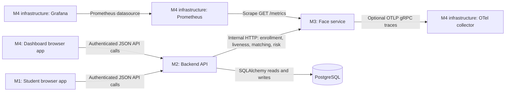

# Implemented features and module connections — 02 October 2026

This inventory describes the application source and configuration currently in the four module directories, with `docker-compose.yml` used to trace deployment connections; dependency directories, generated bundles, binary model assets, and roadmap requirements are not counted as application features.

**Reading guide:** Each inventory row gives a one-sentence feature description, its source, and its service pathway; **API only** means implemented without a caller in the active browser apps, **partial** means code exists but the full connection is incomplete, and **library only** means a reusable component exists without being mounted by the current dashboard.

This is a static code inventory, not a claim that the services were started or that their tests passed; implementation code takes precedence over older comments and documentation.

## 1. How the four modules connect

| Module | Current implementation | Responsibility | Default local address |
| --- | --- | --- | --- |
| M1: `module1-frontend` | Next.js 14 / React student PWA | Collect consent, camera evidence, location, and check-in submissions. | `http://localhost:3000` |
| M2: `module2-backend` | FastAPI / SQLAlchemy | Authenticate users, manage attendance data, coordinate verification, and decide attendance status. | `http://localhost:8000` with business routes under `/api/v1` |
| M3: `module3-face-recognition` | FastAPI / dlib / MediaPipe / OpenCV | Analyze face images and motion sequences and return biometric and risk results. | `http://localhost:8001` |
| M4: `module4-observability` | React 19 / Vite / TanStack Router and Query, plus monitoring configuration | Display attendance records and analytics and configure Prometheus, Grafana, and the OpenTelemetry collector. | `http://localhost:8501` in Compose |

The arrows show requests or exports; API results return to the caller along the same connection.

- M1 and M4 do not call each other: attendance submitted through M1 becomes visible in M4 because both use M2 and its persisted records.
- M1 does not call M3 directly: its local MediaPipe model guides capture, while submitted evidence travels through M2 for server verification.
- M3 does not call M2 or its database: M2 supplies the enrolled template and request evidence, and M3 returns results without storing them.
- The M4 browser app does not read PostgreSQL or query Prometheus directly: its data requests all use M2, while Grafana and the monitoring services are separate infrastructure configured within M4.
- Redis is provisioned and referenced in deployment settings, but the current M2 and M3 application code does not use it for caching, sessions, rate limiting, or challenge storage.

Sources: [Compose services](docker-compose.yml), [M1 API client](module1-frontend/lib/api/client.ts), [M2 face-service client](module2-backend/app/face_service.py), [M4 API client](module4-observability/src/lib/api.ts), [M3 telemetry](module3-face-recognition/app/telemetry.py).

### Pathway reference

The pathway identifiers in the feature tables refer to these concrete call chains; browser calls to M2 use its configured `/api/v1` base URL, whereas calls to M3 use unprefixed service routes.

| ID | Caller and pathway | Result and current behavior |
| --- | --- | --- |
| P1 | M1 `AuthCard` or M4 `AuthPage` → respective API client → M2 `POST /api/v1/auth/register` or `POST /api/v1/auth/login` → `users` table. | Registration creates a bcrypt-backed account, and login returns JWTs and sets an HttpOnly refresh cookie. |
| P2 | M1 `Home` or the M1 client's 401 retry → M2 `POST /api/v1/auth/refresh` → M2 `GET /api/v1/users/me`; M4 `useAuth` → M2 `GET /api/v1/users/me`. | M1 restores and refreshes its in-memory access token from the cookie, while M4 validates its localStorage access token without implementing refresh. |
| P3 | M1 `StudentDashboard` → `getActiveSessions()` → M2 `GET /api/v1/sessions/active` → sessions, courses, enrollments, and motion-policy data. | M2 returns currently open active sessions with venue and policy information, but this list is public and is not filtered to the requesting student's enrollments. |
| P4 | M1 consent controls / `FaceVerification` → `updateConsent()` → M2 `PUT /api/v1/users/me` → `users.camera_consent` and `users.geolocation_consent`. | Consent flags are stored centrally, and the enrollment/motion paths check camera consent. |
| P5 | M1 `FaceVerification.enroll()` → M2 `POST /api/v1/users/me/face/enroll` → `FaceServiceClient.enroll_face()` → M3 `POST /face/enroll` → detection, embedding, template, and quality processing → M2 updates `users`. | Only the returned 64-character template and enrollment flag are persisted, and enrollment failures become HTTP 400 or 503. |
| P6 | M1 `FaceVerification.start()` → M2 `POST /api/v1/motion/challenges` → eligibility checks and `motion_challenges` insert → M1 records frames locally. | M2 issues a student/session/template-bound challenge lasting at most three minutes and no later than the session's check-in closing time; issuance itself does not call M3. |
| P7 | M1 `FaceVerification.submitSequence()` → M2 `POST /api/v1/motion/challenges/{id}/verify` → shared face-service client `POST /liveness/sequence` on M3 → M2 saves scalar outcomes → M1 receives `verification_id`. | M3 verifies two complete blinks, sampled identity, and passive liveness, and M2 only issues usable verification evidence for a passing result. |
| P8 | M1 `StudentDashboard.completeCheckIn()` → M2 `POST /api/v1/checkins/` with a photo → conditional M3 `POST /liveness/check` and `POST /face/verify` → conditional M3 `POST /risk/assess` → M2 geofence/risk decision → `checkins` insert. | Photo liveness uses `passive`, face matching uses the stored enrollment template, and service failures leave missing biometric fields null and allow a geofence-based decision. |
| P9 | M1 `StudentDashboard.completeCheckIn()` → M2 `POST /api/v1/checkins/` with `motion_verification_id` → `motion.consume()` → geofence/risk decision → atomic challenge-consumption and `checkins` transaction. | Previously verified motion evidence is used once without a fresh M3 request, and a motion-required session refuses a check-in without it. |
| P10 | M4 `StudentView` → `fetchMyCheckIns()` → M2 `GET /api/v1/checkins/my-checkins?limit=100` → `checkins`, sessions, and courses → browser row mapping and charts. | Students see their own recorded attendance, and this route requires the actual `student` role. |
| P11 | M4 admin/instructor/TA views → `fetchSessions()` → M2 `GET /api/v1/sessions/?limit=100`; `fetchCheckIns()` then calls M2 `GET /api/v1/checkins/session/{id}` for every returned session in parallel. | M4 joins and sorts the results in the browser; the session-list route allows instructors/admins only, although the per-session check-in route also allows TAs. |
| P12 | M4 `SessionsPanel` → M2 `GET /api/v1/courses/?limit=100` and `GET /api/v1/sessions/?limit=100`; its creation form → M2 `POST /api/v1/sessions/` → `sessions` insert → Query cache invalidation. | The form creates a scheduled one-hour lecture with venue/geofence settings, and the student app can discover it after its status is activated and its check-in window opens. |
| P13 | M4 `AuditLogs` → M2 `GET /api/v1/audit/?limit=200`. | The UI filters and exports results, but M2 currently returns an empty admin-only placeholder rather than stored audit events. |
| P14 | M4 `MetricsPanel` → attempted M2 `GET /api/v1/metrics/?limit=120`. | The client and display exist, but this backend JSON route is absent and is separate from M3's Prometheus text endpoint. |
| P15 | Prometheus configured in M4 → M3 `GET /metrics` every 15 seconds → Prometheus storage; Grafana → Prometheus datasource. | M3 exposes request/operation metrics, while the configured additional M2 `/metrics` scrape target has no endpoint implementation. |
| P16 | M3 request/operation instrumentation → OTLP gRPC exporter → configured collector at `http://otel-collector:4317` → batch processor → debug trace exporter. | The collector also defines an OTLP metrics pipeline to its Prometheus exporter at port 8889, but the application code sends M3 Prometheus metrics through direct scraping instead. |
| P17 | M1 or M4 sign-out → M2 `POST /api/v1/auth/logout` → refresh cookie expiration → caller clears its access token. | Logout clears browser session state, but there is no server-side access-token revocation store. |

## 2. Module 1 — student frontend

Paths in this table are relative to [module1-frontend](module1-frontend).

| Feature/component | What it does — one sentence | Source | Cross-module pathway |
| --- | --- | --- | --- |
| Application entry and session restoration | `Home` restores the authenticated student session and switches between sign-in and the student check-in dashboard. | [app/page.tsx](module1-frontend/app/page.tsx) | P2, P17 |
| Student registration and login | `AuthCard` validates basic form fields and submits student registration or sign-in while showing success and error messages. | [AuthCard.tsx](module1-frontend/components/auth/AuthCard.tsx), [auth.ts](module1-frontend/lib/api/auth.ts) | P1 |
| Local demo mode | Demo mode supplies a sample student/session and a simulated approved result while retaining the camera/location interface. | [app/page.tsx](module1-frontend/app/page.tsx), [StudentDashboard.tsx](module1-frontend/components/check-in/StudentDashboard.tsx) | Local simulation; attendance is not persisted in M2. |
| Student check-in workflow | `StudentDashboard` manages camera, location, verification, review, submission, and result phases for the selected session. | [StudentDashboard.tsx](module1-frontend/components/check-in/StudentDashboard.tsx) | P3–P9 |
| Active-session selector | The session card displays an open session's course, venue, start time, and check-in deadline and resets camera evidence when selection changes. | [StudentDashboard.tsx](module1-frontend/components/check-in/StudentDashboard.tsx), [checkins.ts](module1-frontend/lib/api/checkins.ts) | P3 |
| Explicit consent controls | Camera and location checkboxes gate browser capture actions and persist the user's consent preferences before relevant submissions. | [StudentDashboard.tsx](module1-frontend/components/check-in/StudentDashboard.tsx), [FaceVerification.tsx](module1-frontend/components/check-in/FaceVerification.tsx) | P4 |
| Camera access and permission monitoring | `useCamera` starts a front-facing video stream, reports permission/device failures, and stops tracks on unmount, hidden tabs, revoked permission, or explicit stop. | [useCamera.ts](module1-frontend/features/camera/useCamera.ts) | Browser camera API; captured output feeds P5, P7, or P8. |
| Still-image capture and preview | Camera capture creates a JPEG up to 720 pixels on its longest side and lets the student inspect or retake the photo before enrollment or check-in. | [useCamera.ts](module1-frontend/features/camera/useCamera.ts), [FaceVerification.tsx](module1-frontend/components/check-in/FaceVerification.tsx) | P5 or P8 after confirmation |
| Precise geolocation capture | `useGeolocation` requests a fresh high-accuracy GPS fix with a 12-second timeout and exposes coordinates, accuracy, and permission/error states. | [useGeolocation.ts](module1-frontend/features/geolocation/useGeolocation.ts) | Browser geolocation API → P8 or P9 |
| Browser face-position guidance | `useFaceGuidance` runs the locally served MediaPipe Face Landmarker to require one centered face and provide live capture instructions. | [useFaceGuidance.ts](module1-frontend/features/camera/useFaceGuidance.ts) | Local processing; it does not call the M3 service. |
| Two-blink sequence capture | The guidance hook records timestamped JPEG frames and recognizes two complete blinks while enforcing face continuity, frame gaps, and capture limits. | [useFaceGuidance.ts](module1-frontend/features/camera/useFaceGuidance.ts) | P6 → local capture → P7; browser blink counting is guidance, not the final decision. |
| Face enrollment setup | `FaceVerification` detects missing enrollment, collects camera consent, and sends a confirmed enrollment photo before identity-dependent verification. | [FaceVerification.tsx](module1-frontend/components/check-in/FaceVerification.tsx) | P2, P4, P5 |
| Motion-challenge orchestration | `FaceVerification` starts a server challenge, uploads a completed sequence, handles expiration/retry/cancellation, and passes a successful verification ID into check-in. | [FaceVerification.tsx](module1-frontend/components/check-in/FaceVerification.tsx), [checkins.ts](module1-frontend/lib/api/checkins.ts) | P6, P7, P9 |
| Photo verification alternative | The verification UI supports a still-photo check-in when mandatory motion is disabled and the student selects the photo option. | [FaceVerification.tsx](module1-frontend/components/check-in/FaceVerification.tsx) | P8 |
| Device fingerprint generation | `createDeviceFingerprint` hashes browser language/platform/user-agent and screen dimensions into a base64 SHA-256 identifier attached to check-in requests. | [device.ts](module1-frontend/lib/device.ts) | P8/P9 carry the value, but M2 does not currently associate it with a device record. |
| Check-in result presentation | The result screen displays the backend's approved, flagged, pending, or rejected status with the recorded time and risk score. | [StudentDashboard.tsx](module1-frontend/components/check-in/StudentDashboard.tsx) | Response from P8 or P9 |
| Authenticated HTTP client and retry | `apiRequest` sends JSON and bearer credentials, refreshes once after a 401, and reports structured errors and request timeouts. | [client.ts](module1-frontend/lib/api/client.ts) | All M1 → M2 requests; refresh uses P2. |
| Token and sign-out handling | The frontend holds access tokens in memory, uses the backend's HttpOnly refresh cookie, and clears capture/session state on sign-out. | [client.ts](module1-frontend/lib/api/client.ts), [auth.ts](module1-frontend/lib/api/auth.ts), [StudentDashboard.tsx](module1-frontend/components/check-in/StudentDashboard.tsx) | P2, P17 |
| Offline session snapshots | IndexedDB stores sanitized session summaries for up to 15 minutes and filters already-closed sessions when supplying a read-only fallback. | [sessionCache.ts](module1-frontend/lib/offline/sessionCache.ts) | Local cache of P3 results; no attendance submission queue. |
| Online/offline awareness | The dashboard listens for connectivity changes, displays an offline notice, and disables real attendance submission while offline. | [StudentDashboard.tsx](module1-frontend/components/check-in/StudentDashboard.tsx) | Locally gates P8/P9. |
| PWA manifest and shell caching | The manifest and production-only service worker provide standalone-app metadata and cache same-origin shell/static resources without intercepting API writes. | [manifest.ts](module1-frontend/app/manifest.ts), [sw.js](module1-frontend/public/sw.js), [layout.tsx](module1-frontend/app/layout.tsx) | Local browser functionality |
| Bundled face-guidance assets | The frontend serves pinned MediaPipe WASM binaries and the Face Landmarker model from `/mediapipe` for local camera analysis. | [asset README](module1-frontend/public/mediapipe/README.md), [useFaceGuidance.ts](module1-frontend/features/camera/useFaceGuidance.ts) | Static files from M1; no remote inference call. |
| Responsive and accessible interface | The student interface supplies mobile layouts, focus styling, labeled controls, status announcements, and permission-recovery messages. | [globals.css](module1-frontend/app/globals.css), [AuthCard.tsx](module1-frontend/components/auth/AuthCard.tsx), [StudentDashboard.tsx](module1-frontend/components/check-in/StudentDashboard.tsx) | Local presentation |
| API contracts | Shared TypeScript types define user, session, check-in, token, and submitted-evidence shapes used by the active student app. | [types/api.ts](module1-frontend/types/api.ts) | Compile-time contracts for M1 ↔ M2 |
| Build and container setup | Next.js scripts, standalone-output settings, and the Dockerfile build and serve the student app with a configurable public API base URL. | [package.json](module1-frontend/package.json), [next.config.js](module1-frontend/next.config.js), [Dockerfile](module1-frontend/Dockerfile) | Defaults to M2 at `http://localhost:8000/api/v1`. |

**Inactive alternate implementation:** [app/page 2.tsx](module1-frontend/app/page%202.tsx) contains an older monolithic check-in prototype with manually acknowledged blink/head-turn steps, ECDSA key generation, and an offline payload queue, but it is excluded by [tsconfig.json](module1-frontend/tsconfig.json) and is not the active Next.js page; [globals 2.css](module1-frontend/app/globals%202.css) is likewise not imported by the active layout.

## 3. Module 2 — backend and persistence

Business routes below are implemented in [app/main.py](module2-backend/app/main.py), with [app/motion.py](module2-backend/app/motion.py) providing the motion router.

| Feature/component | What it does — one sentence | Endpoint or source | Cross-module pathway / availability |
| --- | --- | --- | --- |
| User registration | Registration validates email/password/role, rejects duplicate emails, hashes the password, and stores a user account. | `POST /api/v1/auth/register`; [schemas.py](module2-backend/app/schemas.py) | P1; accepts student, TA, instructor, and admin roles. |
| Login and JWT issuance | Login verifies the password and active-account flag and returns a one-hour HS256 access token plus a seven-day refresh token. | `POST /api/v1/auth/login`; [auth.py](module2-backend/app/auth.py) | P1 |
| Refresh cookie and token renewal | Refresh accepts an HttpOnly cookie or explicit JSON refresh token, rechecks the active account, and issues replacement tokens. | `POST /api/v1/auth/refresh`; [main.py](module2-backend/app/main.py) | P2; cookie uses SameSite=Lax and configurable Secure. |
| Logout | Logout expires the backend's browser refresh cookie and returns a success message. | `POST /api/v1/auth/logout` | P17 |
| Current-user lookup | The current-user endpoint returns account identity, role, active state, consent flags, and enrollment state after bearer-token validation. | `GET /api/v1/users/me` | P2 |
| Profile and consent updates | Profile updates persist supplied name/consent fields and HTML-escape an updated full name. | `PUT /api/v1/users/me` | P4; name editing is API only in the active apps. |
| Authentication and role dependencies | Shared dependencies reject invalid/expired/non-access tokens or inactive users and enforce each route's declared roles. | [auth.py](module2-backend/app/auth.py) | Protects browser/API calls; role checks use the stored user account. |
| Administrator account deactivation | Administrators can deactivate an account so subsequent authenticated requests and refresh attempts fail. | `PATCH /api/v1/admin/users/{user_id}/deactivate` | API only |
| Face-enrollment gateway | The backend checks camera consent, forwards the enrollment image to M3, and persists only its returned template and enrolled flag. | `POST /api/v1/users/me/face/enroll`; [face_service.py](module2-backend/app/face_service.py) | P5 |
| Course creation | Administrators can create a uniquely coded course with semester, instructor, venue, geofence, and policy settings. | `POST /api/v1/courses/` | API only; M4 reads courses but does not create them. |
| Course catalog and details | Course reads return instructor and configuration information, with active filtering and bounded pagination on the public catalog. | `GET /api/v1/courses/`, `GET /api/v1/courses/{course_id}` | Catalog used by P12; details require authentication. |
| Course updates | Administrators or the assigned course instructor can change the supported course settings. | `PUT /api/v1/courses/{course_id}` | API only |
| Enrollment creation | Administrators or an owning course instructor can add a student-course enrollment while rejecting duplicate pairs. | `POST /api/v1/enrollments/`, `POST /api/v1/admin/enrollments/` | API only; created enrollments determine check-in eligibility. |
| Student enrollment listing | Students can retrieve their own active enrollments with course, semester, and instructor information. | `GET /api/v1/enrollments/my-enrollments` | API only |
| Course roster listing | Instructors, TAs, and admins can retrieve a course's active roster and each student's enrollment and face-enrollment state. | `GET /api/v1/enrollments/course/{course_id}` | API only |
| Session creation | Instructors/admins can create future sessions with validated time ordering, default check-in windows, and optional motion/biometric/geofence policies. | `POST /api/v1/sessions/` | P12; default window is 15 minutes before to 30 minutes after scheduled start. |
| Active-session discovery | The public active-session route returns sessions whose status is active and whose check-in window currently contains the server time. | `GET /api/v1/sessions/active` | P3 |
| Session listing and detail retrieval | Session reads return course/roster summaries and effective venue/policy information, with filtered pagination for instructor/admin listing. | `GET /api/v1/sessions/`, `GET /api/v1/sessions/{session_id}` | P11/P12; individual detail requires authentication. |
| Session configuration and status updates | Authorized session owners/admins can patch session settings or status, while admins have an additional status route that records actual start/end times. | `PATCH /api/v1/sessions/{session_id}`, `PATCH /api/v1/admin/sessions/{session_id}/status` | API only; M4's current form creates sessions but does not activate them. |
| Venue inheritance and time normalization | Session serialization/check-in logic falls back to course venue/radius/risk settings and normalizes supplied timestamps to naive UTC. | `_effective_venue()`, `_to_naive_utc()` in [main.py](module2-backend/app/main.py) | Used by P3, P8, P9, P11, P12. |
| Motion-policy persistence | An additive per-session policy table stores whether verified motion is mandatory and is exposed through session creation, updates, and responses. | `session_motion_policies`; [motion.py](module2-backend/app/motion.py) | P3/P6/P9; controls whether photo-only check-in is accepted. |
| Motion-challenge issuance | Challenge creation checks student enrollment, session/window eligibility, duplicate attendance, consent, and face enrollment before issuing an expiring attempt. | `POST /api/v1/motion/challenges` | P6 |
| Motion-sequence verification gateway | Verification claims an issued challenge, forwards bounded frames and the enrolled template to M3, validates returned scalars, and marks the attempt verified or failed. | `POST /api/v1/motion/challenges/{challenge_id}/verify` | P7; a service failure returns 503 and provides no proof. |
| Motion expiration, ownership, and one-time consumption | Motion state transitions bind results to a student/session/template, invalidate replaced attempts, reject expired/reused results, and consume proof with the attendance transaction. | `MotionChallenge`, `eligible()`, `consume()` in [motion.py](module2-backend/app/motion.py) | P6/P7/P9; stores metadata and scalar outcomes, not frames. |
| Motion input limits and safe validation errors | Motion schemas and middleware reject oversized, unordered, too-short, or excessively gapped uploads without echoing biometric request input in validation responses. | `Sequence`, `MotionBodyLimit`, `safe_motion_validation()` | M1 → M2 portion of P7 |
| Check-in eligibility and persistence | Student check-in validates session status/window, active enrollment, and duplicate attendance before saving location, verification outcomes, risk factors, and final status. | `POST /api/v1/checkins/` | P8 or P9 |
| Geofence assessment | The backend computes Haversine distance, scales distance risk, records out-of-bounds/low-accuracy factors, and rejects positions beyond twice the effective radius. | `_assess_checkin_geofence()` in [main.py](module2-backend/app/main.py) | Local M2 processing in P8/P9 |
| Photo biometric verification | For a supplied photo, the backend conditionally requests passive liveness and enrolled-face matching according to session flags. | `_run_biometric_verification()`; [face_service.py](module2-backend/app/face_service.py) | P8 → M3 `/liveness/check` and `/face/verify` |
| Risk aggregation and attendance decision | The backend uses the maximum geofence and biometric-service risk, gives geofence/liveness hard failures rejection priority, and otherwise flags at the effective threshold or approves. | `_combine_checkin_assessment()` in [main.py](module2-backend/app/main.py) | P8 obtains M3 `/risk/assess`; P9 derives biometric risk from the saved motion scores. |
| Shared face-service HTTP client | A lazy reusable `httpx.Client` centralizes M3 requests and distinguishes permissive photo-check failures from strict enrollment failures. | [face_service.py](module2-backend/app/face_service.py) | All M2 → M3 calls; defaults are 5 seconds for photo/risk, 10 for enrollment, and 45 for motion. |
| Student attendance history | Students can retrieve their own newest check-ins with optional course filtering and a bounded result limit. | `GET /api/v1/checkins/my-checkins` | P10 |
| Session attendance retrieval | Instructors, TAs, and admins can retrieve check-ins joined with student identity, risk factors, distance, and liveness outcome for a session. | `GET /api/v1/checkins/session/{session_id}` | P11 |
| Device registration and re-registration | Authenticated users can register a unique fingerprint or reactivate/update their own existing device without taking another user's fingerprint. | `POST /api/v1/devices/`; compatibility alias `/api/v1/devices/register` | API only; not invoked by the active M1/M4 apps. |
| Device inventory | Authenticated users can list the device metadata and trust/active state associated with their account. | `GET /api/v1/devices/my-devices` | API only |
| Device updates and trust administration | Owners/admins can rename or activate/deactivate devices, and only admins can change device trust and its low/high trust score. | `PATCH /api/v1/devices/{device_id}` | API only; does not call M3 attestation. |
| Device deletion | Owners/admins can delete a registered device record after an ownership check. | `DELETE /api/v1/devices/{device_id}` | API only |
| Relational data models and constraints | SQLAlchemy models store users, courses, enrollments, sessions, check-ins, devices, and motion metadata with indexes and unique enrollment/check-in pairs. | [models.py](module2-backend/app/models.py), [motion.py](module2-backend/app/motion.py) | M2 alone reads/writes the application database. |
| Database sessions and startup table creation | Database setup loads `DATABASE_URL`, shares a recyclable connection pool, creates registered tables on startup, and supplies transactional or explicitly read-only sessions. | [database.py](module2-backend/app/database.py), [main.py](module2-backend/app/main.py) | M2 → configured database; Compose selects PostgreSQL. |
| Query round-trip reductions | Joined queries, correlated eligibility checks, catalog window counts, read-only autocommit, and responses built from known insert values reduce database round trips. | [database.py](module2-backend/app/database.py), [main.py](module2-backend/app/main.py) | Optimizes catalog reads, P8/P9, and per-session retrieval in P11. |
| API schemas and compatibility routes | Pydantic models validate request fields and legacy `/auth/*` aliases preserve registration/login/refresh/logout/current-user access alongside the versioned API. | [schemas.py](module2-backend/app/schemas.py), [main.py](module2-backend/app/main.py) | M1/M4 use the versioned API. |
| CORS and API documentation | FastAPI publishes OpenAPI documentation and permits credentialed browser calls from its configured localhost:3000 origin. | [main.py](module2-backend/app/main.py) | Covers M1's default origin; M4's default origin is currently missing. |
| Service and database health probes | `/health` returns a basic healthy response and `/db-health` verifies a live database query. | `GET /health`, `GET /db-health` | Infrastructure/API callers; M4 metrics do not use these probes. |
| Container setup | The backend Dockerfile installs Python/database dependencies and serves FastAPI on port 8000. | [Dockerfile](module2-backend/Dockerfile), [requirements.txt](module2-backend/requirements.txt) | Compose supplies database and M3 service URLs. |
| Audit-route access gate — partial | The audit route enforces the admin role and returns an empty list without storing or retrieving audit events. | `GET /api/v1/audit/` | P13; placeholder only |

## 4. Module 3 — face, liveness, and risk service

All biometric processing uses local models and request-scoped data; the current service has no application database or Redis client usage.

| Feature/component | What it does — one sentence | Endpoint or source | Cross-module pathway / availability |
| --- | --- | --- | --- |
| Image decoding and normalization | The decoder accepts strict base64 or image data URIs, validates PNG/JPEG structure and size, applies EXIF orientation, and returns bounded RGB pixels. | [imaging.py](module3-face-recognition/app/imaging.py) | Internal step in P5/P7/P8 |
| Face localization and confidence | Detection combines dlib HOG face locations with overlapping MediaPipe detections to provide confidence, bounding boxes, face counts, and deterministic selection. | [detection.py](module3-face-recognition/app/detection.py) | Internal step in P5/P7/P8 |
| Lazy and thread-local native models | Face detection and single-image FaceMesh initialize lazily with thread-owned model objects to support worker concurrency without sharing unsafe native instances. | [detection.py](module3-face-recognition/app/detection.py), [liveness.py](module3-face-recognition/app/liveness.py) | Internal M3 support |
| Face descriptor extraction | The embedding pipeline produces and validates a finite nonzero 128-dimensional dlib descriptor for the selected face. | [embedding.py](module3-face-recognition/app/embedding.py) | Internal step in P5/P7/P8; raw descriptors are not persisted. |
| Cancelable face-template generation | Seeded random hyperplanes convert a normalized descriptor into a deterministic 256-bit SimHash encoded as 64 lowercase hexadecimal characters. | [template.py](module3-face-recognition/app/template.py) | Template returned in P5 and photo-verification responses. |
| Template comparison and calibrated similarity | Hamming distance between templates is mapped to a bounded similarity score and compared against the configured face-match threshold. | [template.py](module3-face-recognition/app/template.py) | Internal identity decision in P7/P8 |
| Face-image quality assessment | Quality scoring combines detection confidence, face size, sharpness, resolution, and brightness/contrast into a score and good/fair/poor label. | [quality.py](module3-face-recognition/app/quality.py) | Enrollment gate in P5 |
| Face enrollment endpoint | Enrollment checks explicit camera consent, requires one sufficiently confident/usable face, and returns a template and quality metadata after processing. | `POST /face/enroll`; [main.py](module3-face-recognition/app/main.py) | M2 invokes it in P5 and stores the returned template. |
| Enrolled-face verification endpoint | Verification compares a newly captured face against the supplied enrolled template and returns match status, score, threshold, detection state, and current template. | `POST /face/verify`; [main.py](module3-face-recognition/app/main.py) | M2 invokes it in P8; P7 uses the same internal verification pipeline. |
| Legacy face-matching endpoint | The matching compatibility route accepts either reference-hash field name and returns legacy and current result fields from the same verification pipeline. | `POST /face/match`; [schemas.py](module3-face-recognition/app/schemas.py) | API only; M2 uses `/face/verify`. |
| Face-mesh plausibility and inferred depth | FaceMesh analysis summarizes 468-landmark completeness, geometric plausibility, nose depth, and depth variation into aggregate scores. | [liveness.py](module3-face-recognition/app/liveness.py) | Internal liveness step in P7/P8 |
| Texture and presentation analysis | Texture analysis combines blur/sharpness, FFT periodicity, local binary pattern diversity, and luminance variation to penalize screen/print-like presentations. | [liveness.py](module3-face-recognition/app/liveness.py) | Internal liveness step in P7/P8 |
| Color plausibility analysis | Color analysis scores face-region chroma/luminance variation, channel spread, broad color plausibility, and clipping without retaining histograms. | [liveness.py](module3-face-recognition/app/liveness.py) | Internal liveness step in P7/P8 |
| Passive single-image liveness | The liveness engine combines depth, mesh, texture, and color evidence with presentation-integrity gates to decide whether a photo passes the configured threshold. | `POST /liveness/check`; [liveness.py](module3-face-recognition/app/liveness.py) | M2 uses `challenge_type: passive` in P8. |
| Single-frame blink and head-turn proxies | Optional `blink` and `head_turn` modes use eye aspect ratio or yaw asymmetry as explicitly identified single-image challenge evidence. | [liveness.py](module3-face-recognition/app/liveness.py), [schemas.py](module3-face-recognition/app/schemas.py) | API only for these modes; they do not establish a temporal action sequence. |
| Two-blink temporal sequence verification | A fresh FaceMesh tracker checks ordered bounded frames, one-face continuity, two complete blinks, regularly sampled identity, and passive liveness on the first/final frames. | `POST /liveness/sequence`; [motion.py](module3-face-recognition/app/motion.py) | M2 invokes it in P7 and stores only scalar results. |
| Weighted multi-signal risk assessment | Risk scoring weights liveness, face match, device, network, and geolocation signals and returns a total, risk level, contributions, threshold result, and recommendations. | `POST /risk/assess`; [risk.py](module3-face-recognition/app/risk.py) | M2 invokes it in P8 when a biometric score exists; missing signals contribute neutral risk. |
| Network heuristics | Network scoring classifies IP ranges and VPN/proxy/Tor/bot-like user-agent text as risk indicators without external network-intelligence lookups. | [risk.py](module3-face-recognition/app/risk.py) | Implemented in the risk API, but M2's current caller does not forward IP/user-agent signals. |
| Device-material risk heuristics | Device risk checks public-key/signature presence and format without treating those inputs alone as proof of key possession. | [risk.py](module3-face-recognition/app/risk.py) | Implemented in the risk API, but M2's current caller does not forward these fields. |
| Geolocation signal scoring | Geolocation scoring assesses coordinate validity and reported accuracy without calculating distance to the course venue. | [risk.py](module3-face-recognition/app/risk.py) | M2 forwards location to `/risk/assess` in P8; venue-distance checking stays in M2. |
| Cryptographic device attestation | Attestation verifies a supplied RSA, ECDSA, Ed25519, or Ed448 signature over exact challenge bytes and returns trust status and a SHA-256 public-key fingerprint. | `POST /device/attest`; [attestation.py](module3-face-recognition/app/attestation.py) | API only; no M1/M2/M4 caller or server-issued device-challenge lifecycle is wired. |
| Strict request/response contracts | Pydantic contracts reject unexpected fields, invalid score types/ranges, and conflicting reference aliases while defining stable response shapes. | [schemas.py](module3-face-recognition/app/schemas.py), [motion.py](module3-face-recognition/app/motion.py) | M2 ↔ M3 API contracts |
| Biometric-safe error handling and body limits | Middleware and exception handlers reject oversized/invalid inputs and return bounded error metadata without reflecting raw biometric input or native error details. | [main.py](module3-face-recognition/app/main.py) | All inbound M3 API calls |
| Request-local biometric handling | Route handlers process images/descriptors/landmarks in memory and return templates or aggregate results without application persistence or biometric-body logging. | [main.py](module3-face-recognition/app/main.py), [motion.py](module3-face-recognition/app/motion.py) | P5/P7/P8 results return to M2. |
| Structured privacy-filtered logging | Logging filters and a JSON formatter redact credentials, biometric-shaped values, signatures, addresses, and oversized text before emitting records. | [telemetry.py](module3-face-recognition/app/telemetry.py) | Service logs; no database-backed M2 audit trail. |
| HTTP and verification metrics | Prometheus middleware/counters/histograms expose request latency/status and face, liveness, and risk outcomes with bounded labels. | `GET /metrics`; [metrics.py](module3-face-recognition/app/metrics.py) | P15 |
| OpenTelemetry request and operation tracing | Optional FastAPI instrumentation and operation spans export allowlisted scalar metadata while removing default network identifiers and allowing exporter failure without stopping requests. | [telemetry.py](module3-face-recognition/app/telemetry.py) | P16 |
| Configurable thresholds and service settings | Immutable validated settings control match/detection/quality/liveness/risk thresholds, SimHash seed, image limits, CORS, metrics, logging, and telemetry. | [config.py](module3-face-recognition/app/config.py) | Governs M3 verification and observability integration. |
| Service health and discovery | `/health` reports service/version health and `/` returns service metadata and a list of principal endpoint names. | `GET /health`, `GET /`; [main.py](module3-face-recognition/app/main.py) | Infrastructure/API callers; the discovery list currently omits `/liveness/sequence`. |
| Template calibration utility | The calibration script processes supplied same-person/different-person image pairs and prints aggregate distances, quality, and a recommended Hamming boundary. | [scripts/calibrate.py](module3-face-recognition/scripts/calibrate.py) | Offline development utility; no cross-module call. |
| Native-model container setup | A multi-stage Dockerfile builds native dependency wheels and runs the service as a non-root user with an HTTP health check and disabled access logging. | [Dockerfile](module3-face-recognition/Dockerfile), [requirements.txt](module3-face-recognition/requirements.txt) | Compose exposes port 8001 to M2 and monitoring infrastructure. |

**Template terminology:** Although database/API fields use names such as `face_embedding_hash`, the implemented biometric value is a locality-preserving **SimHash**, not an ordinary SHA-256 digest of a face descriptor; SHA-256 is used separately for the M1 device fingerprint and M3 public-key fingerprint.

## 5. Module 4 — attendance console

| Feature/component | What it does — one sentence | Source | Cross-module pathway / availability |
| --- | --- | --- | --- |
| Browser application and routing | The React entry point mounts TanStack Router with a QueryClient, route restoration, a shared shell, and auth/dashboard routes. | [main.jsx](module4-observability/src/main.jsx), [router.tsx](module4-observability/src/router.tsx), [routeTree.gen.ts](module4-observability/src/routeTree.gen.ts) | Local application infrastructure |
| Authentication page | `AuthPage` signs users in or registers a chosen student/TA/instructor role and automatically signs in after registration. | [routes/auth.tsx](module4-observability/src/routes/auth.tsx) | P1 |
| Bearer API client and local token storage | The dashboard client sends JSON and cookie credentials, saves the access token in localStorage, and turns API failures into typed errors. | [lib/api.ts](module4-observability/src/lib/api.ts) | All M4 → M2 calls; no automatic token-refresh retry. |
| Session validation and protected navigation | `useAuth` validates the saved token against the current-user API and the dashboard redirects unauthenticated users to sign-in. | [useAuth.tsx](module4-observability/src/hooks/useAuth.tsx), [routes/index.tsx](module4-observability/src/routes/index.tsx) | P2 |
| Role-aware views and admin preview | The root dashboard selects student, TA, instructor, or admin presentation and lets admins preview other role layouts using their existing credentials. | [useRole.tsx](module4-observability/src/hooks/useRole.tsx), [routes/index.tsx](module4-observability/src/routes/index.tsx) | Presentation choice only; M2 still evaluates the actual account role. |
| Dashboard sign-out | Sign-out calls the backend, clears the locally stored access token, and navigates to authentication on success. | [lib/api.ts](module4-observability/src/lib/api.ts), [routes/index.tsx](module4-observability/src/routes/index.tsx) | P17 |
| Student attendance view | `StudentView` shows recorded personal attendance, approval/flag counts, course-filtered history, and recent activity. | [StudentView.tsx](module4-observability/src/components/dashboard/StudentView.tsx) | P10 |
| Teaching-assistant view — partial | `TaView` provides a read-only attendance panel and an access-error message when session data cannot be loaded. | [TaView.tsx](module4-observability/src/components/dashboard/TaView.tsx) | P11 currently fails at session listing for a TA account. |
| Instructor overview | `InstructorView` displays course/session totals, attendance rate, flags, average risk, course analytics, and tabbed operational panels from fetched data. | [InstructorView.tsx](module4-observability/src/components/dashboard/InstructorView.tsx) | P11 plus P12–P14 for the relevant tabs; course ownership filtering is incomplete. |
| Administrator overview | `AdminView` aggregates fetched sessions/check-ins into platform totals, rates, risk summaries, course analytics, and operational tabs. | [AdminView.tsx](module4-observability/src/components/dashboard/AdminView.tsx) | P11–P14 |
| Session/check-in data adapters | `fetchSessions` maps API sessions and `fetchCheckIns` retrieves each listed session's check-ins in parallel before enriching and sorting the combined records. | [lib/attendance.ts](module4-observability/src/lib/attendance.ts) | P11; fetches the first session page up to 100 items. |
| Attendance display normalization | `toRows` converts raw API records into dashboard rows, scales risk to 0–100, and supplies fallback values for absent display fields. | [lib/attendance.ts](module4-observability/src/lib/attendance.ts) | Local processing of P10/P11 responses |
| Periodic attendance refresh | Query hooks poll check-in data every 30 seconds and update the displayed history, charts, and summaries from refreshed API results. | [StudentView.tsx](module4-observability/src/components/dashboard/StudentView.tsx), [AdminView.tsx](module4-observability/src/components/dashboard/AdminView.tsx), [InstructorView.tsx](module4-observability/src/components/dashboard/InstructorView.tsx), [TaView.tsx](module4-observability/src/components/dashboard/TaView.tsx) | Repeats P10 or P11; no WebSocket/SSE connection. |
| KPI cards | `KpiCard` presents a supplied metric, note, color tone, optional progress bar, and decorative bars. | [KpiCard.tsx](module4-observability/src/components/dashboard/KpiCard.tsx) | No direct service call; values supplied by parent views. |
| Check-in trend chart | `CheckInTrend` renders hourly record counts with approved and flagged proportions from supplied attendance data. | [CheckInTrend.tsx](module4-observability/src/components/dashboard/CheckInTrend.tsx), [trendOf](module4-observability/src/lib/attendance.ts) | No direct service call; derived from P11. |
| Status distribution chart | `StatusPie` renders the proportion of supplied approved, flagged, and mapped no-show rows as a CSS donut chart. | [StatusPie.tsx](module4-observability/src/components/dashboard/StatusPie.tsx) | No direct service call; derived from P11. |
| Recent activity feed | `LiveActivity` lists supplied recent records with student initials, time, course, and mapped status text. | [LiveActivity.tsx](module4-observability/src/components/dashboard/LiveActivity.tsx) | No direct service call; derived from P10/P11. |
| Per-course analytics | `buildCourseStats` and `CourseAnalytics` combine session/check-in data into course totals, expected attendance, flags, average risk, and progress displays. | [InstructorView.tsx](module4-observability/src/components/dashboard/InstructorView.tsx), [CourseAnalytics.tsx](module4-observability/src/components/dashboard/CourseAnalytics.tsx) | Browser aggregation of P11; no backend analytics endpoint. |
| Operational tab navigation | The dashboard's `Tabs` component switches between overview, sessions, check-ins, audit logs, and metrics panels. | [dashboard/Tabs.tsx](module4-observability/src/components/dashboard/Tabs.tsx) | Local presentation |
| Session inventory and expandable attendance | `SessionsPanel` shows session status, schedule, expected roster size, venue/geofence, and expandable check-in lists. | [SessionsPanel.tsx](module4-observability/src/components/dashboard/SessionsPanel.tsx) | P11/P12; check-in rows supplied by the parent. |
| Session creation form | The session form selects a course and posts a future one-hour lecture with room, coordinates, and radius before invalidating the session cache. | [SessionsPanel.tsx](module4-observability/src/components/dashboard/SessionsPanel.tsx) | P12; the displayed expected-attendance input is not submitted. |
| Session-filtered check-in panel | `CheckInsPanel` loads the session selector and filters supplied check-in rows by the chosen session. | [CheckInsPanel.tsx](module4-observability/src/components/dashboard/CheckInsPanel.tsx) | Session selector uses P11; filtering is local. |
| Sortable attendance table | `AttendanceTable` sorts by student/course/time/status/risk, filters status, and displays the matching attendance records. | [AttendanceTable.tsx](module4-observability/src/components/dashboard/AttendanceTable.tsx) | No direct service call; supplied P10/P11 rows. |
| Student course history | `CourseHistory` filters personal records by course and displays the newest records with date, room, and status. | [CourseHistory.tsx](module4-observability/src/components/dashboard/CourseHistory.tsx) | No direct service call; supplied P10 rows. |
| Attendance CSV export | CSV utilities generate quoted UTF-8 downloads for visible attendance rows or one session's rows using data already held in the browser. | [lib/attendance.ts](module4-observability/src/lib/attendance.ts), [AttendanceTable.tsx](module4-observability/src/components/dashboard/AttendanceTable.tsx), [SessionsPanel.tsx](module4-observability/src/components/dashboard/SessionsPanel.tsx) | Local export of P10/P11 data; no backend export endpoint. |
| Audit-log browser and export — partial | `AuditLogs` polls for events and implements actor/type/severity filters, a table, and CSV export against the currently empty audit response. | [AuditLogs.tsx](module4-observability/src/components/dashboard/AuditLogs.tsx) | P13; instructor accounts are rejected by the admin-only route. |
| API metrics display — partial | `MetricsPanel` implements latency/request/success/health cards and endpoint aggregation against an unimplemented backend metrics route. | [MetricsPanel.tsx](module4-observability/src/components/dashboard/MetricsPanel.tsx) | P14; no live latency or API-health feed is connected. |
| Risk distribution and high-risk list | `MetricsPanel` bins supplied 0–100 risk values and lists up to eight check-ins scoring above 70. | [MetricsPanel.tsx](module4-observability/src/components/dashboard/MetricsPanel.tsx) | Local calculations over P11 rows; independent of the missing P14 response. |
| Toast feedback | A Sonner `Toaster` mounted in the root displays authentication/session success and failure notifications. | [ui/sonner.tsx](module4-observability/src/components/ui/sonner.tsx), [routes/__root.tsx](module4-observability/src/routes/__root.tsx) | Local feedback for API actions |
| Missing-page and route-error screens | Root route components provide a 404 page and a recoverable route-error screen with retry/home navigation. | [routes/__root.tsx](module4-observability/src/routes/__root.tsx) | Local routing behavior |
| Responsive styling and style utilities | Tailwind styles and `cn` merge component classes, while a reusable mobile hook detects widths below 768 pixels for library sidebar behavior. | [styles.css](module4-observability/src/styles.css), [utils.ts](module4-observability/src/lib/utils.ts), [use-mobile.tsx](module4-observability/src/hooks/use-mobile.tsx) | Local presentation; mobile hook is used by the unmounted sidebar library. |
| Dashboard build and container setup | Vite scripts and the Node Dockerfile serve the dashboard on Compose port 8501 with a browser-configured API URL. | [package.json](module4-observability/package.json), [vite.config.js](module4-observability/vite.config.js), [Dockerfile](module4-observability/Dockerfile) | API client reads `VITE_API_BASE_URL`, defaulting to M2 at `http://localhost:8000/api/v1`. |

### Monitoring infrastructure configured in Module 4

These components are configuration/deployment implementations; their presence does not mean the M4 browser metrics tab is connected to them.

| Component | What it does — one sentence | Source | Pathway / completeness |
| --- | --- | --- | --- |
| Prometheus scrape configuration | Prometheus is configured to scrape M2, M3, and itself at 15-second intervals and retain metrics in a named volume. | [prometheus.yml](module4-observability/prometheus.yml), [Compose](docker-compose.yml) | P15; M3 implements `/metrics`, M2 does not. |
| Grafana Prometheus datasource | Grafana provisioning installs Prometheus as the default datasource for separate monitoring views. | [datasources.yml](module4-observability/grafana/provisioning/datasources.yml), [Compose](docker-compose.yml) | Grafana → Prometheus; exposed locally on port 3001. |
| Grafana dashboard provider — partial | A file provider is configured to load dashboards from the provisioning directory, but no dashboard JSON definitions are present. | [dashboards.yml](module4-observability/grafana/provisioning/dashboards.yml) | Provider exists; no supplied Grafana dashboard artifact. |
| OpenTelemetry collector | The collector accepts OTLP over gRPC/HTTP, batches incoming data, writes traces to debug output, and exposes a Prometheus metrics exporter. | [otel-collector-config.yml](module4-observability/otel-collector-config.yml), [Compose](docker-compose.yml) | P16; M3 has trace instrumentation, while M2 only has dependencies/environment configuration. |
| Shared local service orchestration | Compose creates the network, health-gated PostgreSQL/Redis services, four application containers, monitoring containers, and persistent infrastructure volumes. | [docker-compose.yml](docker-compose.yml) | Connects M2 to PostgreSQL/M3 and provisions the separate monitoring stack. |

### Reusable UI library components

All components below are implemented under [src/components/ui](module4-observability/src/components/ui), have **no cross-module service calls**, and are **library only** in the active dashboard; the mounted `sonner.tsx` component is listed above separately.

| Component file | What it does — one sentence |
| --- | --- |
| [accordion.tsx](module4-observability/src/components/ui/accordion.tsx) | Provides expandable sections with trigger and content components. |
| [alert-dialog.tsx](module4-observability/src/components/ui/alert-dialog.tsx) | Provides modal confirmation dialogs with action and cancel controls. |
| [alert.tsx](module4-observability/src/components/ui/alert.tsx) | Provides styled message panels with title and description slots. |
| [aspect-ratio.tsx](module4-observability/src/components/ui/aspect-ratio.tsx) | Preserves a configured width-to-height ratio around content. |
| [avatar.tsx](module4-observability/src/components/ui/avatar.tsx) | Displays an avatar image with fallback content. |
| [badge.tsx](module4-observability/src/components/ui/badge.tsx) | Displays compact labels with configurable visual variants. |
| [breadcrumb.tsx](module4-observability/src/components/ui/breadcrumb.tsx) | Provides breadcrumb links, separators, current-page labels, and overflow markers. |
| [button.tsx](module4-observability/src/components/ui/button.tsx) | Provides styled buttons with size/appearance variants and optional child-element composition. |
| [calendar.tsx](module4-observability/src/components/ui/calendar.tsx) | Provides a styled day picker with navigation and focused day-button behavior. |
| [card.tsx](module4-observability/src/components/ui/card.tsx) | Provides card header, title, description, content, and footer containers. |
| [carousel.tsx](module4-observability/src/components/ui/carousel.tsx) | Provides horizontal/vertical sliding content with previous/next controls and arrow-key navigation. |
| [chart.tsx](module4-observability/src/components/ui/chart.tsx) | Wraps Recharts with responsive containers, configurable series colors, tooltips, and legends. |
| [checkbox.tsx](module4-observability/src/components/ui/checkbox.tsx) | Provides a styled accessible checkbox with checked-state indication. |
| [collapsible.tsx](module4-observability/src/components/ui/collapsible.tsx) | Provides collapsible content and its controlling trigger. |
| [command.tsx](module4-observability/src/components/ui/command.tsx) | Provides a searchable command-list interface with groups, shortcuts, and optional dialog presentation. |
| [context-menu.tsx](module4-observability/src/components/ui/context-menu.tsx) | Provides context menus with submenus, checkbox/radio items, labels, and shortcuts. |
| [dialog.tsx](module4-observability/src/components/ui/dialog.tsx) | Provides modal dialog overlays, content, titles, descriptions, and close controls. |
| [drawer.tsx](module4-observability/src/components/ui/drawer.tsx) | Provides sliding drawer content with header/footer and close controls. |
| [dropdown-menu.tsx](module4-observability/src/components/ui/dropdown-menu.tsx) | Provides trigger-based dropdown menus with grouped items and submenus. |
| [form.tsx](module4-observability/src/components/ui/form.tsx) | Connects React Hook Form fields to accessible labels, descriptions, controls, and validation messages. |
| [hover-card.tsx](module4-observability/src/components/ui/hover-card.tsx) | Displays supplementary content when its trigger is hovered or focused. |
| [input-otp.tsx](module4-observability/src/components/ui/input-otp.tsx) | Provides grouped one-time-code input slots with active-caret and separator presentation. |
| [input.tsx](module4-observability/src/components/ui/input.tsx) | Provides a styled standard input with forwarded element references. |
| [label.tsx](module4-observability/src/components/ui/label.tsx) | Provides an accessible styled form label. |
| [menubar.tsx](module4-observability/src/components/ui/menubar.tsx) | Provides desktop-style menu bars with nested, selectable, and grouped menu items. |
| [navigation-menu.tsx](module4-observability/src/components/ui/navigation-menu.tsx) | Provides navigation triggers, links, dropdown content, indicators, and a viewport. |
| [pagination.tsx](module4-observability/src/components/ui/pagination.tsx) | Provides page links, previous/next controls, and omitted-page markers. |
| [popover.tsx](module4-observability/src/components/ui/popover.tsx) | Provides anchored floating content opened by a trigger. |
| [progress.tsx](module4-observability/src/components/ui/progress.tsx) | Displays a supplied completion value as a progress indicator. |
| [radio-group.tsx](module4-observability/src/components/ui/radio-group.tsx) | Provides mutually exclusive option controls with selected-state indicators. |
| [resizable.tsx](module4-observability/src/components/ui/resizable.tsx) | Provides resizable panel groups and drag handles. |
| [scroll-area.tsx](module4-observability/src/components/ui/scroll-area.tsx) | Provides scrollable content with styled scrollbars. |
| [select.tsx](module4-observability/src/components/ui/select.tsx) | Provides an accessible select control with grouped options, labels, and scrolling support. |
| [separator.tsx](module4-observability/src/components/ui/separator.tsx) | Provides horizontal or vertical content separators. |
| [sheet.tsx](module4-observability/src/components/ui/sheet.tsx) | Provides a side-mounted dialog panel with overlay, headings, and close controls. |
| [sidebar.tsx](module4-observability/src/components/ui/sidebar.tsx) | Provides responsive collapsible navigation with mobile sheets, keyboard toggling, menu slots, and cookie-written expansion state. |
| [skeleton.tsx](module4-observability/src/components/ui/skeleton.tsx) | Displays animated placeholder blocks for loading content. |
| [slider.tsx](module4-observability/src/components/ui/slider.tsx) | Provides a styled numeric range slider. |
| [switch.tsx](module4-observability/src/components/ui/switch.tsx) | Provides an accessible binary on/off toggle. |
| [table.tsx](module4-observability/src/components/ui/table.tsx) | Provides styled table, row, header, cell, caption, and footer primitives. |
| [tabs.tsx](module4-observability/src/components/ui/tabs.tsx) | Provides accessible tab lists, triggers, and associated content panels. |
| [textarea.tsx](module4-observability/src/components/ui/textarea.tsx) | Provides a styled multiline text input. |
| [toggle-group.tsx](module4-observability/src/components/ui/toggle-group.tsx) | Provides grouped selectable toggle buttons with shared size/appearance settings. |
| [toggle.tsx](module4-observability/src/components/ui/toggle.tsx) | Provides a selectable pressed/unpressed button. |
| [tooltip.tsx](module4-observability/src/components/ui/tooltip.tsx) | Provides brief contextual help attached to a trigger. |

The dashboard's active charts/tables/tabs mostly use their own dashboard components and HTML/CSS rather than these library equivalents.

## 6. End-to-end examples

### A. Enrollment followed by a motion-verified attendance record

1. M1 signs in through M2 and loads open sessions using P1–P3.
2. M1 obtains browser consent and a photo, persists camera consent through P4, and enrolls through P5 if required.
3. M2 sends the photo to M3, and M3 returns the SimHash template that M2 stores on the user.
4. M1 starts an expiring challenge through P6 and uses its own local MediaPipe model to guide a two-blink capture.
5. M1 uploads timestamped frames through P7; M2 forwards them and the stored template to M3, which verifies temporal blinks, identity, and passive liveness.
6. M2 stores the passing scalar results and returns a verification ID, and M1 then submits that ID with GPS and its fingerprint through P9.
7. M2 consumes the proof, computes venue distance, combines geofence risk with `max(1 - liveness_score, 1 - face_match_score)`, and commits the attendance record and proof-consumption state together.
8. M4 later retrieves the record through P10 or P11 and calculates its displays in the browser.

### B. Photo-based attendance

1. M1 captures a confirmed photo and GPS fix and sends them to M2 through P8.
2. M2 checks eligibility and computes distance from the effective session/course venue.
3. If the session requires liveness, M2 sends the image to M3 `/liveness/check` in passive mode; if the session requires face matching and an enrollment template exists, M2 also calls M3 `/face/verify`.
4. If at least one biometric score is available, M2 sends those scores and geolocation accuracy to M3 `/risk/assess`.
5. M2 rejects a performed liveness failure or a location beyond twice the radius, otherwise flags risk at/above threshold or approves, and persists the result for later M4 reads.

### C. Instructor session creation becomes student-visible

1. M4 reads the course catalog, creates a scheduled session through P12, and reloads its session list.
2. An instructor/admin must activate the session through M2's status/update API because the current dashboard has no activation action and the backend has no automatic scheduler.
3. Once active and within its check-in window, the session appears in M1 through P3, and M2 verifies the student's enrollment when a challenge/check-in is submitted.

### D. Face-service monitoring

1. M3 emits HTTP and verification metrics at `/metrics`, which the separate Prometheus container scrapes through P15.
2. Grafana can query that Prometheus datasource, although no dashboard JSON is included.
3. When configured, M3 exports trace spans through P16 to the collector's debug output; this path does not feed the React dashboard's missing JSON metrics API.

## 7. Current integration limits and components not yet connected

These distinctions prevent existing UI labels, stored columns, dependency declarations, or specification examples from being mistaken for a working feature.

| Area | What the current code actually implements | Source evidence |
| --- | --- | --- |
| Dashboard technology | M4 is a React/Vite browser app rather than the Streamlit/direct-database design described by older integration documentation. | [M4 package](module4-observability/package.json), [API client](module4-observability/src/lib/api.ts) |
| Dashboard browser access | M2's CORS allowlist contains `http://localhost:3000` but not M4's default `http://localhost:8501`, and the Vite configuration supplies no API proxy. | [M2 main](module2-backend/app/main.py), [Vite config](module4-observability/vite.config.js) |
| API base configuration | M1 reads `NEXT_PUBLIC_API_URL` and M4 reads `VITE_API_BASE_URL`, while Compose's dashboard `BACKEND_URL`, `DATABASE_URL`, and `PROMETHEUS_URL` are not read by its browser client. | [M1 client](module1-frontend/lib/api/client.ts), [M4 client](module4-observability/src/lib/api.ts), [Compose](docker-compose.yml) |
| TA session access | The TA view is implemented, but its shared `fetchSessions()` call reaches an instructor/admin-only route and therefore cannot load the full workflow under a TA account. | [TaView](module4-observability/src/components/dashboard/TaView.tsx), [M2 session routes](module2-backend/app/main.py) |
| Instructor course scope | The instructor UI derives its visible course set from all returned sessions, while the backend session-list and check-in-read routes do not filter by instructor ownership or TA assignment. | [InstructorView](module4-observability/src/components/dashboard/InstructorView.tsx), [M2 main](module2-backend/app/main.py) |
| Admin role previews | Switching an admin's layout to student does not change the account role, so the student-only personal-history API rejects those admin credentials. | [dashboard route](module4-observability/src/routes/index.tsx), [M2 history route](module2-backend/app/main.py) |
| Dashboard authentication expiry | M1 restores/refreshes tokens, but M4 has no refresh call and only validates the access token saved in localStorage. | [M1 client](module1-frontend/lib/api/client.ts), [M4 client](module4-observability/src/lib/api.ts), [useAuth](module4-observability/src/hooks/useAuth.tsx) |
| Photo verification requirements | Missing photos/templates or an unavailable M3 service can leave photo-path checks unperformed without forcing rejection, whereas enrollment and mandatory motion fail without valid service results. | [biometric/check-in logic](module2-backend/app/main.py), [face client](module2-backend/app/face_service.py), [motion router](module2-backend/app/motion.py) |
| Consent enforcement | The active UI gates camera/location capture and M2 checks camera consent for enrollment/motion, but the legacy photo check-in route does not require stored camera/geolocation consent flags. | [StudentDashboard](module1-frontend/components/check-in/StudentDashboard.tsx), [M2 main](module2-backend/app/main.py), [motion router](module2-backend/app/motion.py) |
| Course biometric policies | Course face-recognition/device-binding flags are stored, but photo biometric decisions use session flags and venue inheritance does not copy those course policy flags. | [models](module2-backend/app/models.py), [venue/biometric logic](module2-backend/app/main.py) |
| Device binding | Device CRUD and fingerprint generation exist, but check-in does not resolve a registered device, enforce its trust/key, increment its check-in count, or call M3 `/device/attest`. | [device.ts](module1-frontend/lib/device.ts), [M2 check-in/device routes](module2-backend/app/main.py), [M3 attestation](module3-face-recognition/app/attestation.py) |
| Audit trail | M4's audit UI exists, but M2's audit route returns an empty placeholder and no `AuditLog` persistence model or action-recording implementation is present. | [AuditLogs](module4-observability/src/components/dashboard/AuditLogs.tsx), [M2 main](module2-backend/app/main.py), [models](module2-backend/app/models.py) |
| Metrics and tracing | M3 implements direct Prometheus metrics and OTLP traces, but M2 has no `/metrics` or `/api/v1/metrics/` route and no OpenTelemetry setup despite installed dependencies and Compose variables. | [M3 metrics](module3-face-recognition/app/metrics.py), [M3 telemetry](module3-face-recognition/app/telemetry.py), [M2 main](module2-backend/app/main.py), [MetricsPanel](module4-observability/src/components/dashboard/MetricsPanel.tsx) |
| Dashboard biometric/location fields | Session check-in reads omit liveness score, face-match score, and coordinates, so M4's mapper uses zero/null fallbacks rather than exposing the stored values in charts/exports. | [M2 session check-in serializer](module2-backend/app/main.py), [M4 attendance mapper](module4-observability/src/lib/attendance.ts) |
| Dashboard no-show meaning | `toRows` maps every status other than approved/flagged to `no_show`, so rejected/pending records appear in no-show displays and missing attendance records are not inferred from enrollment. | [attendance.ts](module4-observability/src/lib/attendance.ts), [StudentView](module4-observability/src/components/dashboard/StudentView.tsx), [StatusPie](module4-observability/src/components/dashboard/StatusPie.tsx) |
| Dashboard row completeness | The mapper leaves room as `—` and course ID empty, and the student-history response lacks student identity fields because it is already scoped to the caller. | [attendance.ts](module4-observability/src/lib/attendance.ts), [M2 history route](module2-backend/app/main.py) |
| Course risk and trend calculations | Course average risk rounds a 0–1 raw average without multiplying by 100, and hourly trends merge records with the same local hour across dates. | [buildCourseStats](module4-observability/src/components/dashboard/InstructorView.tsx), [trendOf](module4-observability/src/lib/attendance.ts) |
| Expected attendance and pagination | The creation form's expected-attendance input is unused, backend summaries derive expected attendance from active enrollments, and dashboard adapters do not paginate beyond their first 100 sessions/courses/personal records. | [SessionsPanel](module4-observability/src/components/dashboard/SessionsPanel.tsx), [attendance.ts](module4-observability/src/lib/attendance.ts), [M2 main](module2-backend/app/main.py) |
| Reviews, appeals, and QR attendance | Models/request schemas contain review, appeal, and QR-related fields, but no review/appeal workflow or QR verification/generation route is implemented. | [models](module2-backend/app/models.py), [schemas](module2-backend/app/schemas.py), [M2 routes](module2-backend/app/main.py) |
| Risk-signal records and behavioral protections | Check-ins store JSON risk factors, but a dedicated `RiskSignal` model, impossible-travel/behavior analysis, Redis-backed rate limiting, and active device/network integration are absent. | [models](module2-backend/app/models.py), [M2 check-in logic](module2-backend/app/main.py), [M3 risk](module3-face-recognition/app/risk.py) |
| Retention and user data operations | Nullable scheduled-deletion fields exist, but automatic retention cleanup, user data deletion/export, and the broader statistics/export/admin-user endpoints described in the specifications are not implemented. | [models](module2-backend/app/models.py), [M2 implemented routes](module2-backend/app/main.py) |
| Inactive frontend prototype | Offline submission queuing and browser ECDSA key generation appear only in the excluded alternate page and are not features of the active student workflow. | [alternate page](module1-frontend/app/page%202.tsx), [tsconfig](module1-frontend/tsconfig.json), [active page](module1-frontend/app/page.tsx) |
| Motion observability detail | The sequence route receives generic HTTP metrics/tracing, but the metrics route allowlist lacks `/liveness/sequence` and its handler does not record dedicated sequence outcome counters. | [M3 metrics](module3-face-recognition/app/metrics.py), [sequence handler](module3-face-recognition/app/main.py) |

## 8. Existing verification assets

The repository includes HTTP/API tests under [tests/public](tests/public) for API functionality, browser-client contracts, security, privacy, face recognition, integration, performance, and observability, plus targeted tests under [new-tests](new-tests) for refresh cookies, native face processing, motion sequence validation, and backend challenge/consumption behavior.

These files describe available validation coverage rather than additional application features, and some public tests target specification endpoints that the current code has not implemented; no application code was changed or live-service test run performed to create this document.
